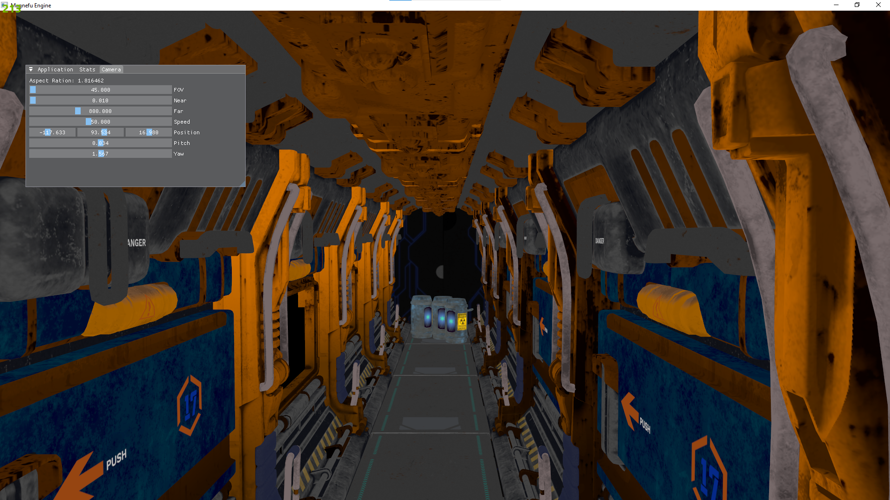
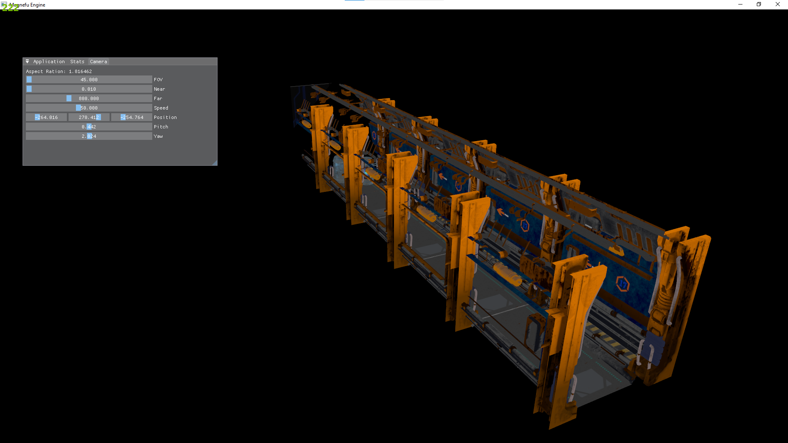
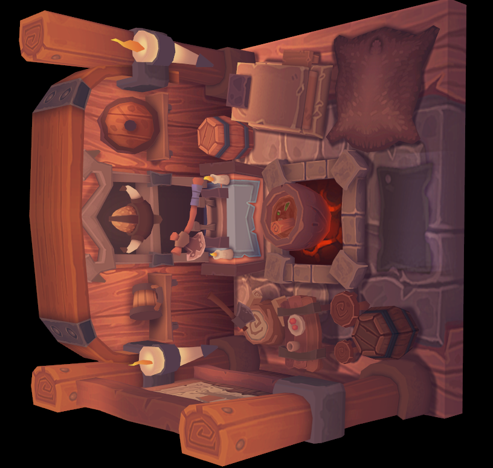

# Magnefu Game Engine

<!-- TABLE OF CONTENTS -->

## Description

With the 3 pillars of Physics, AI, and Chemistry, the Magnefu Game Engine aims to be a game development tool for creating truly novel gameplay experiences, not just focusing purely on graphics but on interactions with the systems and AI of the game world. The hope is to create a base for truly emergent AI that surprises the player at every turn, physics that mimic(as much as possible) what one would expect and world systems that feel intuitive. ~For now, only OpenGL is being used but Vulkan and Direct3D graphics APIs will be supported in the future(perhaps Metal as well).~ Actually, I just made the switch from OpenGL to Vulkan. It was about time. Vulkan is challenging, but both from a performance and organization perspective, I feel the change is worth it.

## Currently Supported Platforms
- Windows x64

## Currently Supported Graphics APIs
- Vulkan

## Installation

## Premake

Project files can be generated - only Windows for now - by running the GenerateProjects.bat

## Building

Note that if you receive a message about Magnefu.dll not being a valid win32 application, delete the .vs folder in the root directory and then rerun the GenerateProjects.bat.

## Controls

- Key binds
> 

## Features

### Events

### Math Library

### Memory Allocation

### Renderer
- Model Loading & Diffuse Textures
> 
> 

- MSAA

No MSAA
> 

MSAAx8
> 

- Compute Shader

Using compute shader to calculate particle movement.
>

### Resource Management

## Incomplete Features

## Known Bugs

## Debugging Tools

### Nvidia Nsight Graphics
### RenderDoc
### brave://tracing/ (chrome://tracing)

## Updates!
From here on out, I'll post weekly updates on the engine. This includes new features, refactors, optimizations and more! Blog blog.alleriumlabs.com coming soon. It will have more in depth versions of the updates below.

- 15 May 2023 -> 21 May 2023 | Starting the switch to vulkan using this [tutorial](https://vulkan-tutorial.com/). I've learned about the swap chain, setting up a graphics pipeline and how to compile shaders to the spv binary.

- 22 May 2023 -> 28 May 2023 | It was a long road but I'm finally drawing a triangle with Vulkan. Also learning about the concept of having multiple frames in flight.

- 29 May 2023 -> 04 June 2023 | Doing some refactoring in order to introduce abstraction for the Vulkan API. Handling changes in the framebuffer and swap chain on window resize. Handling special case of window minimization.

- 05 June 2023 -> 11 June 2023 | Got a lot done this week! Introduced textures, texture sampling, depth buffers and...model loading. I finally have a 3D model rendering with vulkan. As a bonus, I learned how to setup mipmapping and MSAA.

- 12 June 2023 -> 18 June 2023 | Compute shaders baby! I've used compute shaders to do the movement calculations for particles on the screen. This also required a better understanding of Vulkan's VkSemaphore and VkFence synchronization primitives. This marks the tutorial completion. To celebrate finishing the tutorial, I have removed OpenGL completely and I'm starting to implement imgui. Slightly more complicated than doing so with OpenGL but hopefully the github [example](https://github.com/ocornut/imgui/tree/master/examples/example_glfw_vulkan) will be helpful.

- 19 June 2023 -> 25 June 2023 | Early notes: Nvidia Nsight Graphics is amazing! The frame debugger helped me debug some frustrating issues(constant flickering of imgui widgets) I had implementing dear imgui. The ability to know the order of events every frame and to be able to step through frames much like we can use break points to step through code is priceless. So ImGui is now working as expected.