# Magnefu Game Engine

## Description

With the 3 pillars of Physics, AI, and Chemistry, the Magnefu Game Engine aims to be a game development tool for creating truly novel gameplay experiences, not just focusing purely on graphics but on interactions with the systems and AI of the game world. The hope is to create a base for truly emergent AI that surprises the player at every turn, physics that mimic(as much as possible) what one would expect and world systems that feel intuitive. For now, only OpenGL is being used but Vulkan and Direct3D graphics APIs will be supported in the future(perhaps Metal as well).

## Installation

## Controls

## Features
- Test Scenes

## Test Scenes

These test scenes are here for the purpose of showcasing different rendering techniques from lighting to shading to loading models. As I learn more about the different Graphics APIs and graphics rendering in general,
I will add more of these test scenes as a way of showing my understanding of the theory. Eventually, when the engine is actually underway, they could be a great way for other users to see how different rendering concepts can be implemented.

### Test Clear Color

Just a simple test to change the background color.

### Test 2D Render

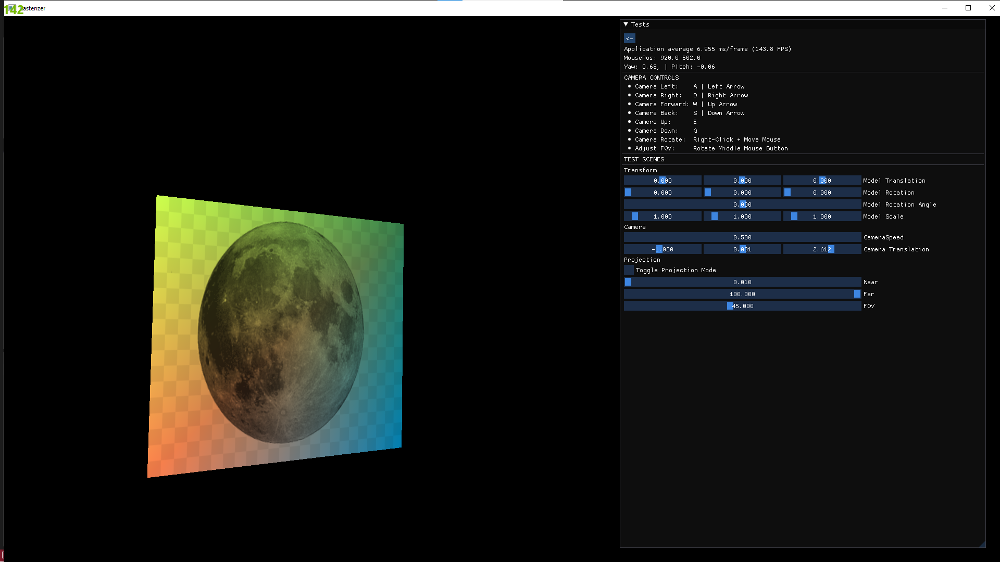

### Test 3D Render

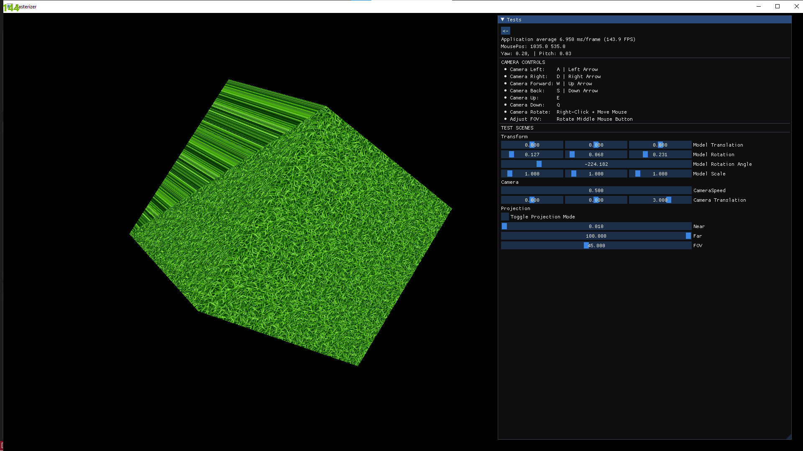

### Test Batching

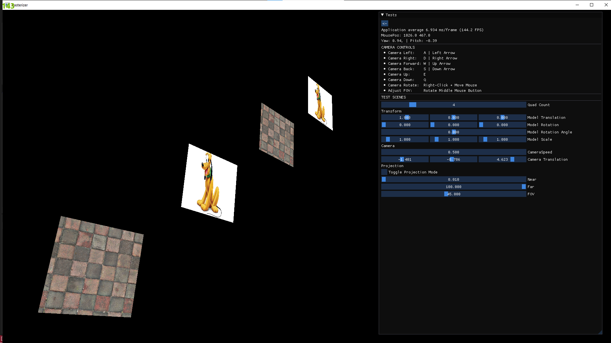

### Test Light Types

- Lighting Images
> 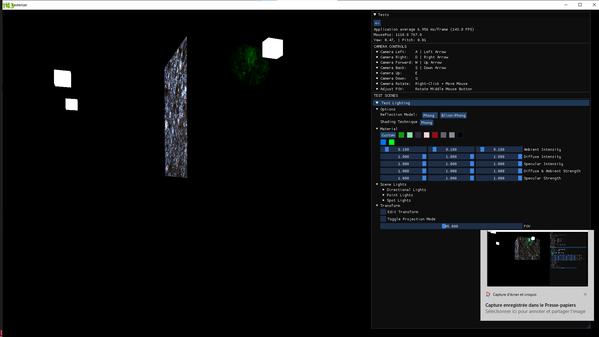
> 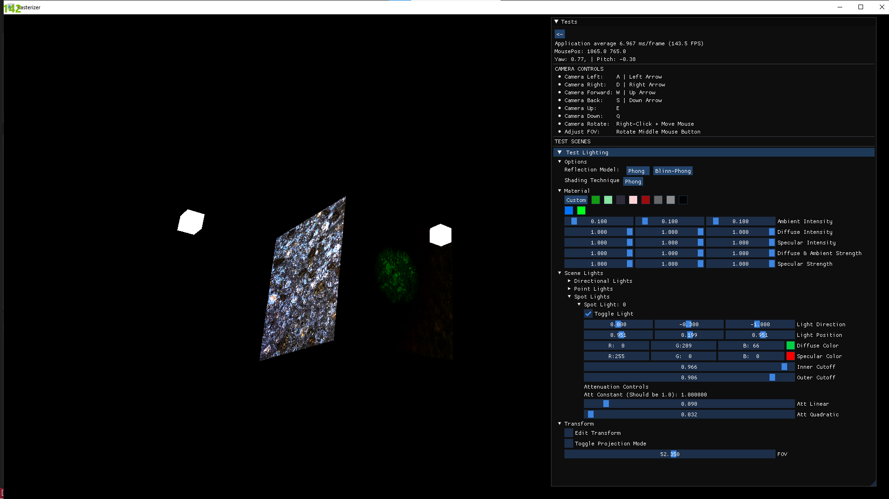

- Lighting GIFs
> 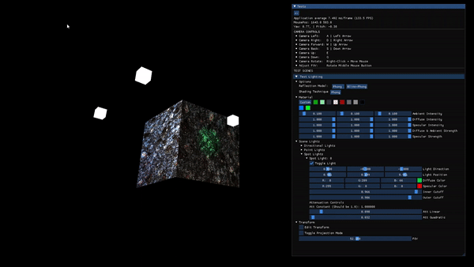
> 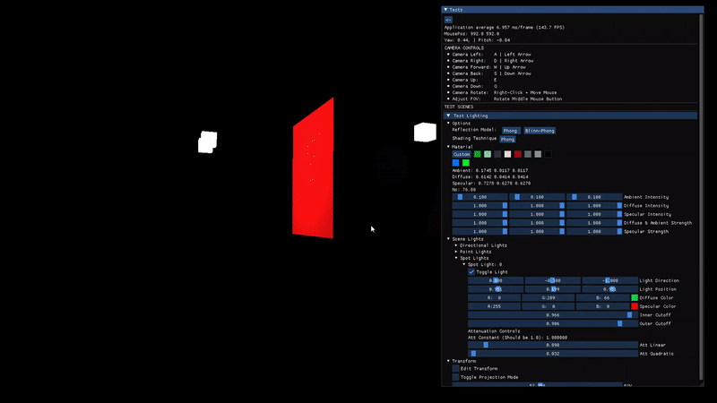
> 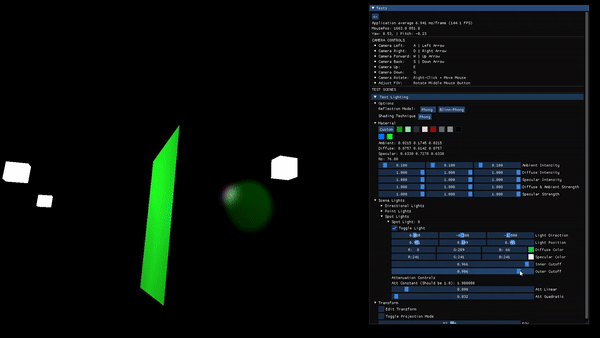
> 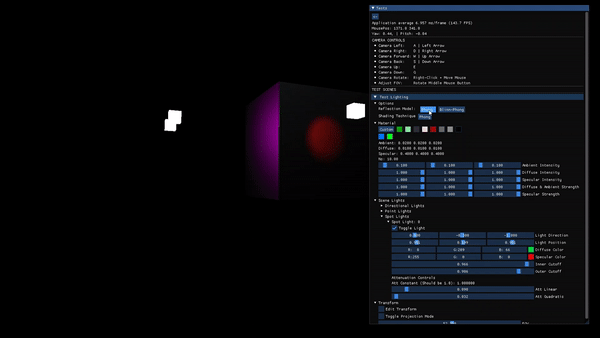

### Test Model Loading

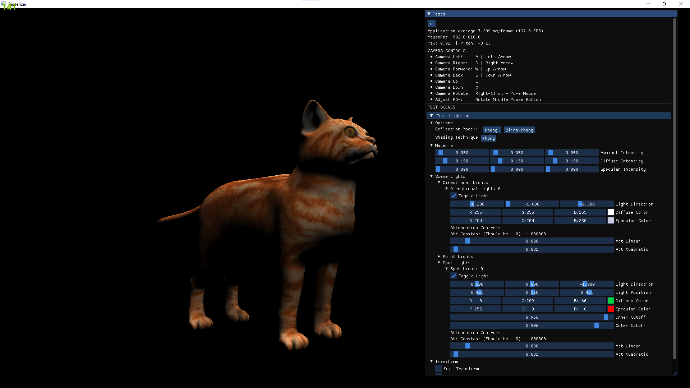

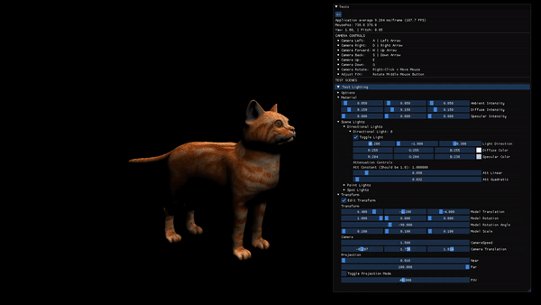

## Incomplete Features

## Known Bugs