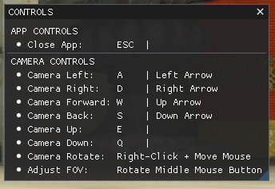
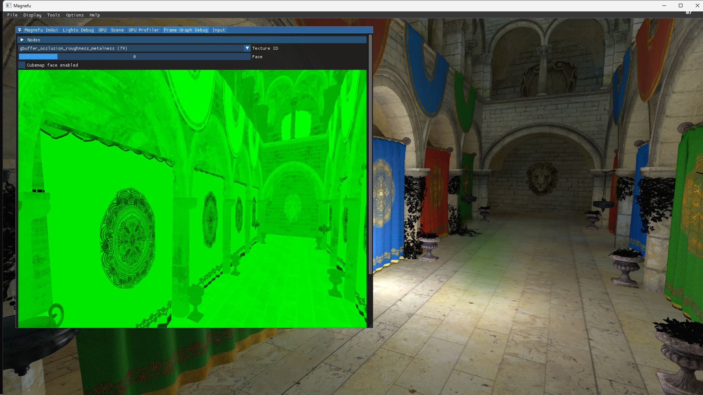

# Magnefu Game Engine

## Table of Contents
- [Magnefu Engine](#magnefu-engine)
    + [Description](#description)
    + [Support](#support)
      - [Platforms](#platforms)
      - [Graphics APIs](#graphics-apis)
    + [Installation](#installation)
      - [Premake](#premake)
        + [Windows](#windows)
        + [MacOS](#macos)
    + [Controls](#controls)
    + [Features](#features)
      - [Core](#core)
      - [Graphics](#graphics)
      - [Editor](#editor)
      - [Audio](#audio)
      - [ECS](#ecs)
    + [Bugs](#bugs)
    + [Debugging Tools](#debugging-tools)
    + [Devlog](#devlog)
    + [End](#end)

## Description

## Support
### Platforms
- Windows x64

### Graphics APIs
- Vulkan

## Installation

### Premake

#### Windows
1. Create Visual Studio project files by running GenerateProjects.bat in root directory.

#### MacOS

## Controls

- Key binds
> 

## Features
### Core
- Logging
> 

### Graphics
- Lighting
> 
- Volumetric Fog
> 
- Raytracing
> 

### Editor
- Frame Graph Debugger
> 
> 
> 
> 

<table>
  <tr>
    <td rowspan="4"><strong>Frame Graph Debugger</strong></td>
    <td></td>
    <td>Displays the normal vectors in the frame graph.</td>
  </tr>
  <tr>
    <td></td>
    <td>Shows the color output in the frame graph.</td>
  </tr>
  <tr>
    <td></td>
    <td>Shows occlusion, roughness, and metallic values.</td>
  </tr>
  <tr>
    <td></td>
    <td>Displays the depth information in the frame graph.</td>
  </tr>
</table>

## Bugs
- Ray Tracing
> 

## Debugging Tools
- Nvidia Nsight Graphics
- RenderDoc
- chrome://tracing

## Updates!
Devlog coming soon: leonlaglace.com/blog.

- 26 June 2023 -> 02 July 2023 | I have introduced all of the basic material textures: roughness, metallic, normal and ambient occlusion. Getting the right calculations for the normals was a little tricky but between this [article](https://learnopengl.com/Advanced-Lighting/Normal-Mapping) and some help from GPT, I was able to succeed. There is also the addition of a point light to show off the additional textures. The fragment shader is using the basic BRDF lighting algorithm(to great effect I might add). I'll have a screenshot included in the readme to showcase the new visuals. Next week will likely be less exciting visually. Going to focus on code abstraction in the engine, with my sights set dead on setting up a materials system. I also have a lot of excess code in the shader that needs to be cleaned up.

- 19 June 2023 -> 25 June 2023 | Early notes: Nvidia Nsight Graphics is amazing! The frame debugger helped me debug some frustrating issues(constant flickering of imgui widgets) I had implementing dear imgui. The ability to know the order of events every frame and to be able to step through frames much like we can use break points to step through code is priceless. So ImGui is now working as expected.

- 12 June 2023 -> 18 June 2023 | Compute shaders baby! I've used compute shaders to do the movement calculations for particles on the screen. This also required a better understanding of Vulkan's VkSemaphore and VkFence synchronization primitives. This marks the tutorial completion. To celebrate finishing the tutorial, I have removed OpenGL completely and I'm starting to implement imgui. Slightly more complicated than doing so with OpenGL but hopefully the github [example](https://github.com/ocornut/imgui/tree/master/examples/example_glfw_vulkan) will be helpful.

- 05 June 2023 -> 11 June 2023 | Got a lot done this week! Introduced textures, texture sampling, depth buffers and...model loading. I finally have a 3D model rendering with vulkan. As a bonus, I learned how to setup mipmapping and MSAA.

- 29 May 2023 -> 04 June 2023 | Doing some refactoring in order to introduce abstraction for the Vulkan API. Handling changes in the framebuffer and swap chain on window resize. Handling special case of window minimization.

- 22 May 2023 -> 28 May 2023 | It was a long road but I'm finally drawing a triangle with Vulkan. Also learning about the concept of having multiple frames in flight.

- 15 May 2023 -> 21 May 2023 | Starting the switch to vulkan using this [tutorial](https://vulkan-tutorial.com/). I've learned about the swap chain, setting up a graphics pipeline and how to compile shaders to the spv binary.